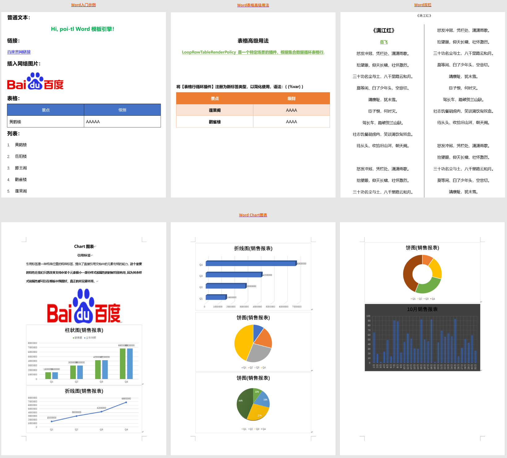
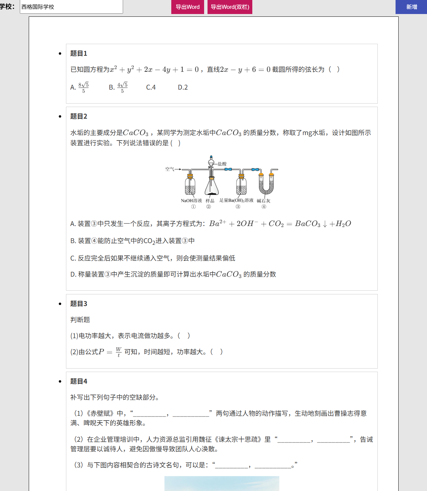
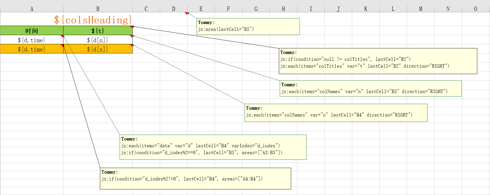
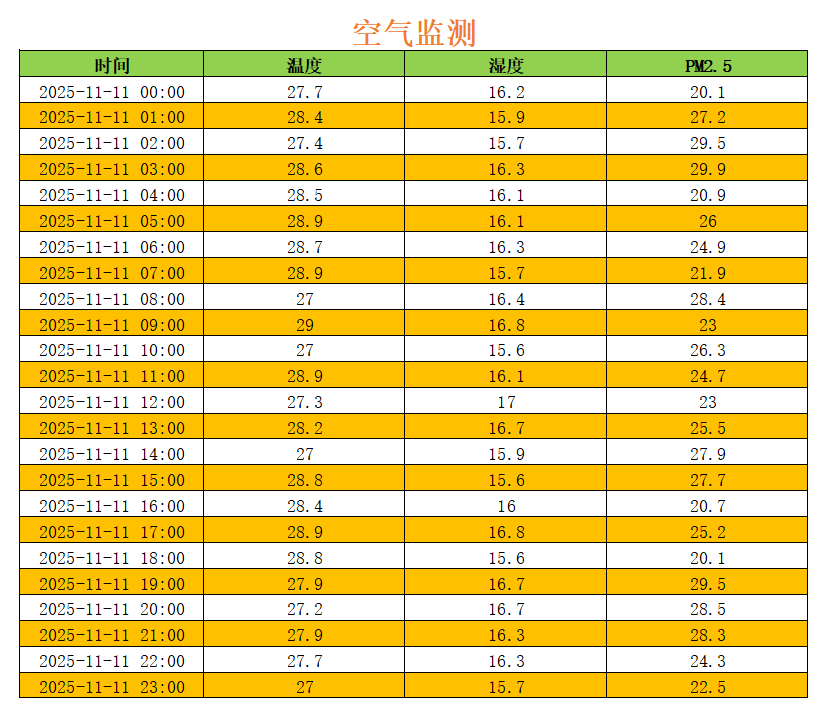

        

<h1 align="center" style="font-weight: bold;">TyOfficeTools</h1>
<h4 align="center">以高性能的Open Source技术方案，打造开箱即用的报表导出工具</h4>

    
    
    

报表导出功能，作为业务系统中的高频需求，堪称其标配特性之一。然而，受限于编程语言的多样性，不同系统所采用的实现方案往往大相径庭。若能统一采用同一种编程语言进行开发，不仅性能表现将显著提升，系统复杂度也能得到有效控制，进而大幅降低后续的维护成本。

本项目旨在以**高性能**的**Open Source**技术方案，打造**开箱即用**的报表导出工具，全面覆盖**Word**、**Excel**、**PDF**等主流报表格式，满足各业务场景需求。

### Word报表
基于模板的Word报表生成实现，使用熟悉的Office工具在docx文件中进行版面设计，如样式、布局等，这种**所见即所得的设计**，确保了Word生成的效果，同时大幅降低Hard Coding。

- #### 模板示例
  

- #### 报表样例
  

  

### Excel报表

Excel报表生成，依旧**所见即所得的设计**，保持风格的一脉相承。

- #### 模板示例
  
  
- #### 报表示例
  
  

### PDF报表

PDF报表，暂未发现直接性的基于模板生成的技术方案，但可以采用迂回策略。

**步骤：**

1. 首先生成Word报表；
2. 最后，将Word文件转换为PDF文件。

**注：本项目采用 aspose.words for java 进行格式转换，若需商业用途，请购买官方授权。**

### 使用说明

- #### Word报表工具类 WordUtil

  此类位于：`com.ty.util.office.WordUtil`，调用方法：`write(Map<String, Object> data, File templateFile, String savePath)`

  - 参数说明：
    - **data**：是传递到模板中的数据，将占位符渲染为真正的数据；
      - Object接受的数据类型如下：
        - String
        - List<String>
        - TextRenderData 
        - HyperlinkTextRenderData
        - ByteArrayPictureRenderData
        - FilePictureRenderData
        - UrlPictureRenderData
        - TableRenderData
        - NumberingRenderData
        - ChartMultiSeriesRenderData
        - ChartSingleSeriesRenderData
    - **templateFile**：是模板文件的File对象；
    - **savePath**：是报表生成的保存路径；

- #### Excel报表工具类 ExcelUtil

  此类位于：`com.ty.util.office.ExcelUtil`，调用方法：`write(Map<String, Object> dataset, String templatePath, String savePath) `

  - 参数说明：
    - dataset：是传递到模板中的数据，将占位符渲染为真正的数据；
    - templatePath：是模板文件的路径；
    - savePath：是报表生成的保存路径；

### 项目体验

说一千道一万，都没有直接体验，最有**Feeling**。

**两种方式：**

- **本地 java main 函数运行**

  相关用例代码位于`src/test/java/com/ty`，可直接运行，零配置，即可看到效果。

- **项目为SpringBoot Web项目，可Run起来**

  访问：`http://localhost`

### 附

- #### Word模板语法

  访问了解更多：[https://deepoove.com/poi-tl/](https://deepoove.com/poi-tl/)

- #### Excel模板语法

  访问了解更多：[https://jxls.sourceforge.net/getting-started.html](https://jxls.sourceforge.net/getting-started.html)

- #### Aspose.Words For Java

  访问了解更多：[https://docs.aspose.com/words/zh/java/convert-a-document-to-pdf/](https://docs.aspose.com/words/zh/java/convert-a-document-to-pdf/)

